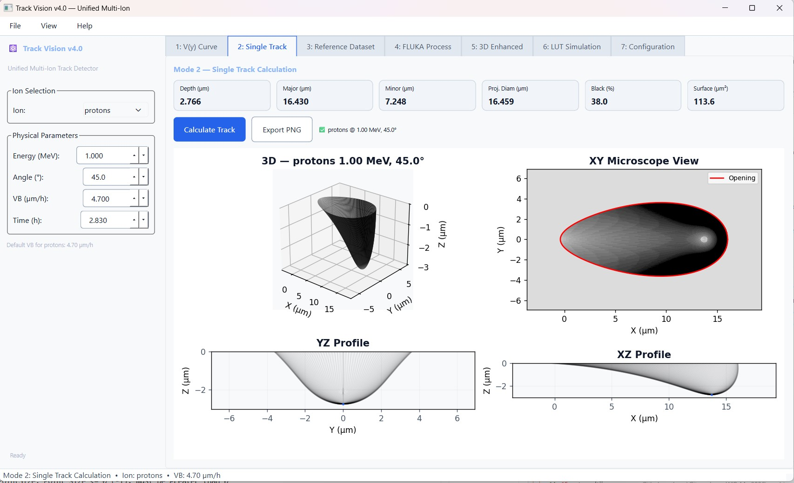

# ⚛️ TrackLab — Nuclear Track Analysis in PADC (CR-39)

<p align="center">
  
</p>

[](https://amele972.github.io/TrackLab/)
[](LICENSE)
[](https://www.python.org/)
[](tests/)

**TrackLab** is a Python package that simulates the formation of tracks during chemical etching from latent trails left by charged particles (protons, alpha particles, lithium, carbon, oxygen) in CR-39 plastic detectors, and models their optical appearance under a transmission microscope.

It acts as a physical bridge between Monte Carlo particle transport simulations (e.g. FLUKA, GEANT4) and physical detector observations.

---

## 🏛️ Heritage and Modernization

TrackLab is a complete, modernized Python reimplementation and expansion of the original Fortran codes:
* **[TRACK_P](https://www.cityu.edu.hk/nru/Track_P.htm)**: Originally developed by D. Nikezic and K.N. Yu for simulating proton track geometry.
* **[TRACK_VISION](https://www.cityu.edu.hk/nru/Track_Vision.htm)**: Developed by the same authors for rendering the optical appearance of etched tracks.

This modern framework preserves the original physical foundations while extending the capabilities to handle multiple ion species, process large-scale Monte Carlo datasets (like FLUKA phase-space), and provide an interactive Graphical User Interface—all unified within a single Python environment.

---

## ✨ Features

- 🔬 **Unified Multi-Ion Physics**: Run calculations for Protons, Alphas, Lithium, Carbon, and Oxygen in a single tool.
- 🎲 **Monte Carlo Integration**: Import phase-space outputs directly from codes like FLUKA and convert them into simulated track profiles.
- 📸 **Realistic Optical Appearance**: Full 3D ray-tracing engine that simulates light propagation, reflection, and refraction to render true-to-life transmission microscope images.
- 🖥️ **Interactive Dashboard**: Feature-rich PyQt6 graphical interface for seamless analysis and visualization.
- 🚀 **High Performance**: Written in vectorized Python (NumPy/SciPy), making large-scale calculations significantly faster.

---

## ⚙️ How it Works

TrackLab computes the three-dimensional geometry of etched tracks by modelling the competition between the bulk detector etch rate ($V_B$) and the track etch rate ($V_T$). 

The track etch rate depends on the particle's residual range $R'$, calculated using SRIM range-energy tables and empirical parametrizations of the reduced etch-rate ratio $V(R') = V_T(R') / V_B$. For protons, TrackLab uses the standard Nikezic and Yu double-exponential model. For light ions, a Broken Power Law (BPL) or other selected empirical functions are used.

After computing the 3D track mesh, TrackLab simulates its appearance under a transmission optical microscope by performing full 3D vector ray-tracing, checking for Total Internal Reflection (TIR), and computing intensity based on condenser-cone averaging and numerical aperture (NA) limits.

---

## 🖥️ Graphical User Interface

TrackLab features a comprehensive GUI for configuring parameters and running all operational modes without writing any code.

<p align="center">
  
</p>

- **Mode 1:** V(y) Curve Explorer
- **Mode 2:** Single Track Simulation (3D + Microscope view)
- **Mode 3:** Look-Up Table (LUT) Creator
- **Mode 4:** Monte Carlo (FLUKA) Processor
- **Mode 5:** 3D Visualization & CAD Export
- **Mode 6:** Fast LUT Interpolation
- **Mode 7:** System Configuration

To launch the dashboard, simply run:
```bash
tracklab-gui
```
*(Or use `python run_gui.py` from the source directory)*

---

## 💻 Installation

To set up **TrackLab** locally:

```bash
# 1. Clone the repository
git clone https://github.com/amele972/TrackLab.git
cd TrackLab

# 2. Create and activate a virtual environment
python -m venv .venv
# On Windows: .venv\Scripts\Activate.ps1
# On macOS/Linux: source .venv/bin/activate

# 3. Upgrade pip and install
python -m pip install --upgrade pip
pip install -e ".[dev]"
```

---

## 🚀 Quick Start

Here is a quick script demonstrating how to calculate track parameters programmatically:

```python
import numpy as np
from tracklab.calculate_track_parameter import calculate_track_parameters

# Calculate track parameters for a 1.5 MeV proton at 75° incidence
res = calculate_track_parameters(
    energy_MeV_u=1.5, 
    angle_deg=75.0, 
    vb_um_h=4.7, 
    time_etching_h=2.83,
    ion='protons'
)

print(f"Status: {res['status']}")
print(f"Depth:  {res['depth_um']:.4f} um")
print(f"Major Axis: {res['major_axis_um']:.4f} um")
print(f"Minor Axis: {res['minor_axis_um']:.4f} um")
```

---

## 🛠️ Configuration & GUI

When TrackLab GUI opens for the first time, a Configuration Summary will appear showing the active V(y) physics models:

- **Protons** : Nikezic / Double-Exponential (Model 1) <- default
- **Alpha**   : Hermsdorf (2009) (Model 5) <- default
- **Li, C, O**: Broken Power Law (BPL) — automatic

If these match your experiment, click "Got it, Launch TrackLab!". 
To change models at any time, go to the Configuration tab (Mode 7) in the app or use `Help -> Show Configuration Summary (F1)`.

---

## 📓 Interactive User Guide

For a step-by-step walk-through of the physics engine and analysis modes with executable code examples, check out the interactive Jupyter Notebook in the root directory:
* [TrackLab_User_Guide.ipynb](TrackLab_User_Guide.ipynb)

---

## 📖 Building the Documentation

The documentation can be built locally using Sphinx:

```bash
cd docs
make html
```

After building, open `docs/_build/html/index.html` in your web browser.

---

## 📜 Citations & References

The physics models underpinning TrackLab are based on the original works by Nikezic and Yu, as well as models established by Hermsdorf for the $V(R')$ sensitivity function.

If you use TrackLab, please consider citing the original models:

* **TRACK_P (Proton Tracks)**: D. Nikezic and K. N. Yu, *"A computer program TRACK_p for studying proton tracks in PADC detectors"*, SoftwareX, 5, 74–79, (2016). [DOI: 10.1016/j.softx.2016.04.006](https://doi.org/10.1016/j.softx.2016.04.006)
* **TRACK_VISION (Optical Simulation)**: D. Nikezic and K. N. Yu, *"Computer program TRACK_vision for simulating optical appearance of etched tracks in CR-39 nuclear track detectors"*, Computer Physics Communications, 178(8), 591–595, (2008). [DOI: 10.1016/j.cpc.2007.11.011](https://doi.org/10.1016/j.cpc.2007.11.011)
* **V-Function Models**: 
  - D. Hermsdorf, *"Measurement and comparative evaluation of the sensitivity V for protons and hydrogen isotopes registration in PADC detectors of type CR-39"*, Radiation Measurements 44, 806–812, (2009).
  - D. Hermsdorf, *"Evaluation of the sensitivity function V for registration of $\alpha$-particles in PADC CR-39 solid state nuclear track detector material"*, Radiation Measurements 44, 283–288, (2009).

---

## 📄 License

This project is licensed under the MIT License - see the [LICENSE](LICENSE) file for details.
