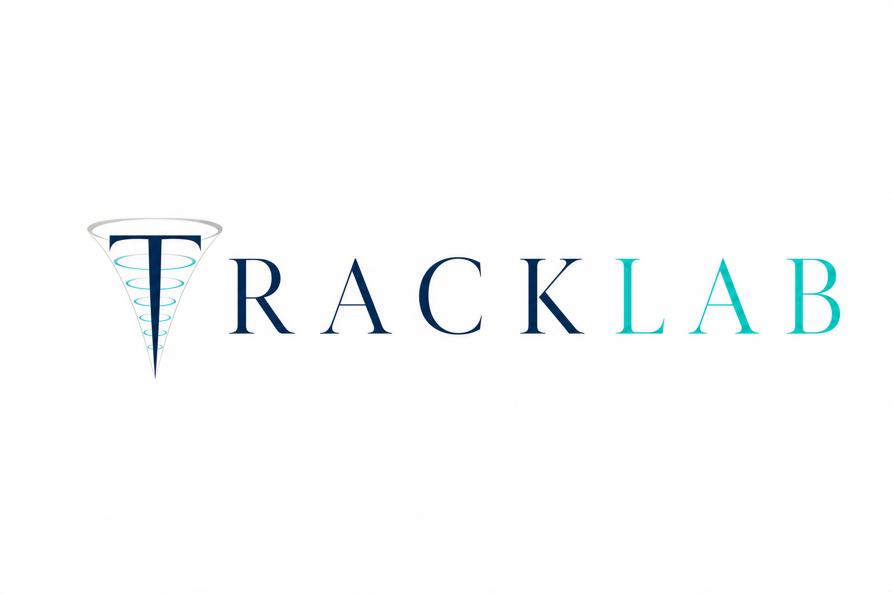

# ⚛️ TrackLab — High-Fidelity Nuclear Track Analysis in PADC (CR-39)

<p align="center">
  
</p>

[](https://amele972.github.io/TrackLab/)
[](LICENSE)
[](https://www.python.org/)
[](tests/)

**TrackLab** is a Python package that simulates how charged particles (protons, alpha particles, lithium, carbon, oxygen) leave tracks in CR-39 plastic detectors, and models their optical appearance under a transmission microscope after chemical etching.

It acts as a physical bridge between Monte Carlo particle transport simulations (e.g. FLUKA, GEANT4) and physical detector observations.

---

## 🎯 Features

* **Unified Ion Physics**: Run calculations for multiple ions (Protons, Alphas, Lithium, Carbon, Oxygen) in a single tool.
* **From Monte Carlo to the Microscope**: Import phase-space outputs from codes like FLUKA and convert them into simulated track profiles, opening dimensions, and realistic 2D microscope views.
* **High Performance**: Written in clean, vectorized Python (using NumPy/SciPy), making calculations up to 100x faster than legacy Fortran codes.
* **Interactive Dashboard**: Feature-rich PyQt6 graphical interface featuring 7 simulation and analysis modes.

---

## 🛠️ Analysis Modes

1. **V(y) Curve Explorer**: Plot the track-to-bulk etch rate ratio ($V = V_T/V_B$) as a function of the particle's residual range.
2. **Single Track Simulation**: Simulate and render an individual track based on energy, angle, and etch parameters.
3. **Look-Up Table (LUT) Creator**: Generate a database of track geometries over user-defined energy and angle grids.
4. **Monte Carlo (FLUKA) Processor**: Convert collective phase-space records into expected detector-response and track distributions.
5. **Ultra-3D Visualization**: Generate and export high-fidelity 3D meshes (**OBJ, STL**) for Blender rendering or 3D printing.
6. **Fast LUT Interpolation**: Estimate track parameters in real-time by interpolating against precomputed databases.
7. **System Configuration**: Inspect active parameters, bulk etch rates, and paths.

---

## 💻 Installation

To set up **TrackLab** on Windows:

```powershell
# 1. Clone the repository
git clone https://github.com/amele972/TrackLab.git
cd TrackLab

# 2. Create a virtual environment
python -m venv .venv
.venv\Scripts\Activate.ps1

# 3. Upgrade pip and install in editable mode with development dependencies
python -m pip install --upgrade pip
pip install -e ".[dev]"
```

---

## 🚀 Minimal Working Example

Here is a quick script demonstrating how to calculate track parameters programmatically:

```python
import numpy as np
from tracklab.load_srim_data import load_srim_data
from tracklab.vt_utils import build_vrint_interpolator
from tracklab.vt_multiion import get_model
from tracklab.calculate_track_parameter import calculate_track_parameters

# 1. Load range tables and initialize multi-ion physics model
interps, _ = load_srim_data()
vt_model = get_model()

# 2. Precompute the cumulative etch-rate integral
F = build_vrint_interpolator(vt_model=vt_model, ion='protons', energy=1.5, vb=4.7)

# 3. Calculate track parameters for a 1.5 MeV proton at 75° incidence
res = calculate_track_parameters(
    energy=1.5, angle_deg=75.0, vb=4.7, time_etching=2.83,
    range_interpolator=interps['protons'], F_interp=F,
    ion='protons', vt_model=vt_model
)

print(f"Status: {res['status']}")
print(f"Depth:  {res['depth_um']:.4f} um")
print(f"Major Axis: {res['major_axis_um']:.4f} um")
print(f"Minor Axis: {res['minor_axis_um']:.4f} um")
print(f"Black fraction: {res['black_part']:.4f}")
```

To launch the graphical dashboard, simply run:
```bash
tracklab-gui
# or:
python run_gui.py
```

---

## 📖 Building the Documentation

The documentation can be built locally using Sphinx:

```powershell
pip install -e ".[dev]"
cd docs
make html
```

After building, open `docs/_build/html/index.html` in your web browser.

---

## 📜 Citations

If you use TrackLab in your scientific publications, please cite the original physical models and software:

* **Proton Tracks (`TRACK_P`)**:
  > D. Nikezic and K. N. Yu, *"A computer program TRACK_p for studying proton tracks in PADC detectors"*, **SoftwareX**, 5, 74–79, (2016). [DOI: 10.1016/j.softx.2016.04.006](https://doi.org/10.1016/j.softx.2016.04.006)
* **Optical Simulation (`TRACK_VISION`)**:
  > D. Nikezic and K. N. Yu, *"Computer program TRACK_vision for simulating optical appearance of etched tracks in CR-39 nuclear track detectors"*, **Computer Physics Communications**, 178(8), 591–595, (2008). [DOI: 10.1016/j.cpc.2007.11.011](https://doi.org/10.1016/j.cpc.2007.11.011)

---

## 📄 License

This project is licensed under the MIT License - see the [LICENSE](LICENSE) file for details.
